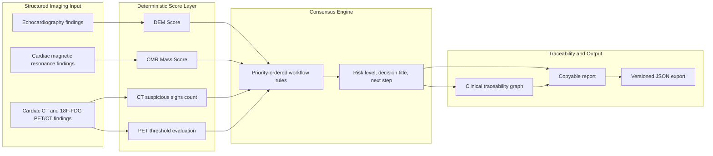
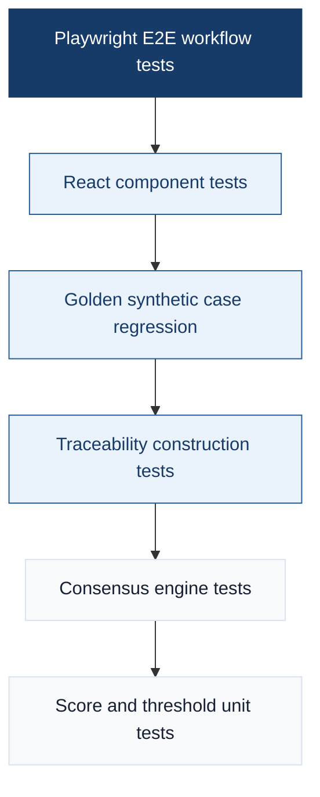
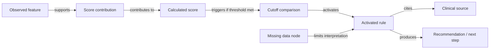
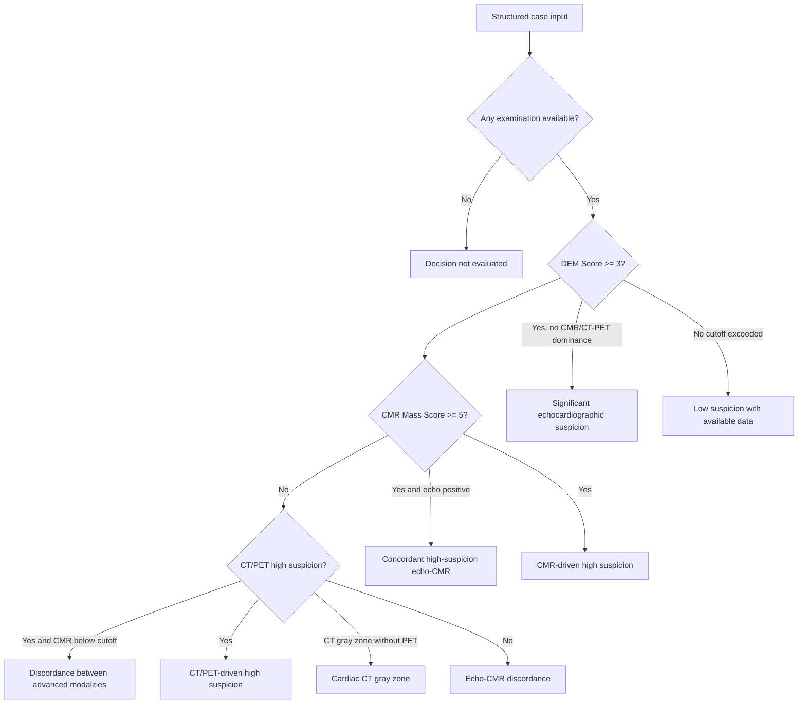
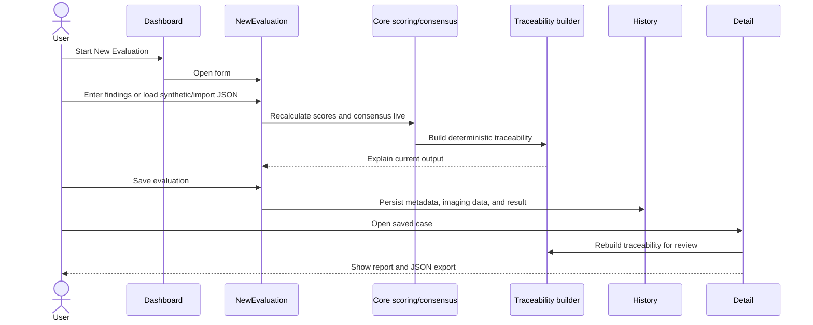
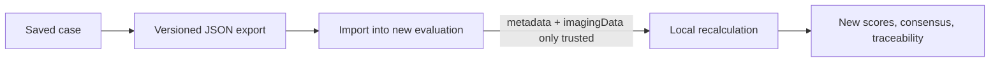

# Validation Methodology

This document defines the validation strategy for the cardiac mass CDSS prototype.

The validation scope is functional, deterministic, and methodological. It verifies that the implemented software behaves according to the encoded literature-derived score definitions, cutoffs, consensus rules, traceability model, and user workflow. It does not estimate clinical diagnostic performance.

## Validation Claim

The prototype is validated as a reproducible software artifact:

```text
Given the same structured imaging inputs,
the system must produce the same scores, consensus output, traceability graph, report content,
and import/export behavior.
```

This is intentionally different from a clinical validation claim:

```text
This validation does not measure sensitivity, specificity, AUC, survival prediction,
or real-world diagnostic accuracy.
```

Clinical performance validation would require patient-level data, confirmed final diagnoses, predefined inclusion criteria, and retrospective or prospective statistical analysis.

## Scope Boundary

| In scope | Out of scope |
|---|---|
| Correct DEM Score calculation | Autonomous diagnosis |
| Correct CMR Mass Score calculation | Claims of sensitivity, specificity, or AUC |
| Correct cardiac CT and 18F-FDG PET/CT threshold handling | Clinical outcome prediction |
| Deterministic multimodality consensus | Replacement of specialist judgment |
| Traceability from input feature to source-backed recommendation | Certified medical device validation |
| Golden synthetic case regression | Real-world clinical deployment validation |
| UI workflow and JSON import/export | PACS/EHR integration validation |

## CDSS Pipeline Under Validation

The first visual layer should show the whole system at a glance. This is useful in the thesis because it separates clinical input, deterministic reasoning, and human review.



Validation objective:

- Every block has automated tests or deterministic golden-case checks.
- No block depends on probabilistic or LLM-generated reasoning.
- Imported JSON is treated as input data; scores, consensus, and traceability are recalculated locally.

## Validation Pyramid

The second visual layer explains why the validation strategy is not based only on end-to-end testing. Lower layers verify clinical logic; upper layers verify integrated user behavior.



| Layer | Purpose | Main artifacts |
|---|---|---|
| Score and threshold unit tests | Verify feature weights, maximum values, cutoffs, PET positivity, and runtime hardening | `packages/core/tests/scores/*` |
| Consensus engine tests | Verify risk titles, priority order, discordance handling, and missing-data behavior | `packages/core/tests/consensus/engine.test.ts` |
| Traceability tests | Verify evidence chain, activated rules, missing data, and sources | `packages/core/tests/traceability/builder.test.ts` |
| Golden synthetic cases | Verify representative scenarios end to end at core level | `packages/core/tests/golden-cases.test.ts` |
| Component tests | Verify UI-level interactions and rendered explanations | `packages/frontend/src/components/*.test.tsx` |
| Playwright E2E | Verify the complete user workflow in a browser | `packages/frontend/e2e/full-workflow.spec.ts` |

## Traceability Validation Model

The traceability figure is the most important visual for the thesis because it shows that the output is inspectable, not just displayed.



Traceability acceptance criteria:

- Activated features must be visible when they contribute to a score.
- Score nodes must expose the calculated value and cutoff comparison.
- Rule nodes must explain why the consensus title was produced.
- Missing modalities must be explicit and must not be silently interpreted as negative findings.
- Source nodes must identify the source family used for score or workflow interpretation.
- The report must include traceability content for saved-case review.

## Multimodality Decision Flow

This diagram is intentionally simplified for thesis readability. It does not replace the code-level consensus tests, but it helps readers understand the main decision branches.



Interpretation notes:

- The production consensus engine is priority ordered and tested in code.
- The system avoids summing DEM, CMR, CT, and PET into a single mega-score.
- Discordance remains visible and usually triggers review or additional imaging rather than automatic down-classification.

## Golden Case Coverage Matrix

The golden cases are synthetic and deterministic. They are not patient data. Their purpose is to cover representative software states: empty input, low suspicion, single-modality positivity, multimodality concordance, discordance, gray-zone CT, PET clarification, and missing data.

Legend:

| Symbol | Meaning |
|---|---|
| `+` | Modality contributes positive/high-suspicion evidence |
| `-` | Modality entered but below implemented cutoff |
| `G` | Gray zone |
| `M` | Missing or unavailable |
| `D` | Discordance is the main scenario |

| Case | Echo | CMR | CT | PET | Main validation target | Expected risk |
|---|---:|---:|---:|---:|---|---|
| GC-00 | M | M | M | M | Empty-state behavior | not |
| GC-01 | - | M | M | M | Low suspicion with available data | low |
| GC-02 | + | M | M | M | Echo-positive triage to second-level imaging | mid |
| GC-03 | + | + | M | M | Echo-CMR concordant high suspicion | high |
| GC-04 | M | + | M | M | CMR-driven high suspicion | high |
| GC-05 | + | - / D | M | M | Echo-CMR discordance | mid |
| GC-06 | M | M | G | M | CT gray zone without PET | mid |
| GC-07 | M | M | G | + | PET clarification of CT gray zone | high |
| GC-08 | M | M | - | + / D | CT/PET discordance | mid |
| GC-09 | M | - / D | + | + | Discordance between advanced modalities | high |

Relationship with implementation:

- The detailed case definitions are documented in `docs/synthetic-cases.md`.
- The same scenarios are automated in `packages/core/tests/golden-cases.test.ts`.
- The UI exposes them through the `Demo / Import Tools` panel for screenshots and reproducibility.

## User Workflow Validation

The browser workflow validates that the prototype remains usable as a clinical cockpit and not just as isolated score functions.



E2E acceptance criteria:

- Empty dashboard is understandable.
- New evaluation shows the three modality panels.
- Synthetic golden cases can populate the form.
- JSON import populates metadata and imaging data.
- Scores and consensus update live.
- Save creates a dashboard entry.
- Detail view shows consensus, report, traceability, original imaging data, and JSON export.
- Delete removes saved cases.

## JSON Import/Export Validation



Validation rule:

- Imported `result` or `traceability` fields are not trusted as authoritative diagnostic output.
- The application loads metadata and imaging data, then recalculates scores, consensus, and traceability locally.
- This prevents stale or manually edited JSON output from bypassing the deterministic engine.

## Reproducibility Commands

The current functional validation can be reproduced with:

```bash
pnpm -r run test
pnpm build
pnpm --filter @cm-dss/frontend run test:e2e
```

Expected outcome:

- All core unit tests pass.
- All frontend component tests pass.
- Production build succeeds.
- Playwright E2E workflow passes.

## Acceptance Criteria Summary

| Area | Acceptance criterion | Evidence artifact |
|---|---|---|
| Score algorithms | Feature weights, cutoffs, and thresholds match implementation mapping | Core score tests and `docs/source-mapping.md` |
| Consensus logic | Priority-ordered decisions match predefined workflow states | Consensus tests and golden cases |
| Traceability | Decision can be reconstructed from features, scores, cutoffs, rules, sources, and recommendations | Traceability tests and UI panel |
| Golden cases | `GC-00` through `GC-09` produce expected risk and title | `packages/core/tests/golden-cases.test.ts` |
| UI workflow | Main user path works in browser | Playwright E2E |
| Import/export | JSON import recalculates output locally and export preserves structured case data | Case JSON tests and E2E |
| Safety framing | Missing data and prototype limitations remain explicit | Traceability missing-data nodes and UI/report disclaimers |

## Limitations

Current limitations:

- Golden cases are synthetic and cannot estimate real-world clinical accuracy.
- Feature annotation is structured and manual; image interpretation quality is outside the current validation scope.
- The consensus workflow is deterministic and paper-derived, but it is not a newly validated clinical score.
- Missing data behavior is conservative software behavior and must be interpreted by a clinician.
- The current PWA is a prototype and not a certified medical device.

Future clinical validation would require:

- A retrospective or prospective patient cohort.
- Confirmed final diagnosis or adjudicated reference standard.
- Patient-level train/validation/test separation if any model or retrieval component is introduced.
- Predefined performance endpoints such as sensitivity, specificity, PPV, NPV, calibration, and AUC when applicable.
- Clinical expert review of false positives, false negatives, and discordant cases.

## Thesis Figure Recommendations

The most thesis-ready figures from this document are:

| Figure | Best use |
|---|---|
| CDSS Pipeline Under Validation | Methodology or architecture chapter |
| Validation Pyramid | Validation chapter opening figure |
| Traceability Validation Model | Explainability/traceability chapter |
| Multimodality Decision Flow | Consensus engine explanation |
| Golden Case Coverage Matrix | Functional validation results section |
| User Workflow Validation | Prototype implementation and UX chapter |

If space is limited, prioritize the CDSS pipeline, traceability model, and golden case matrix.
